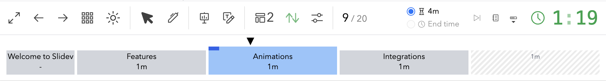
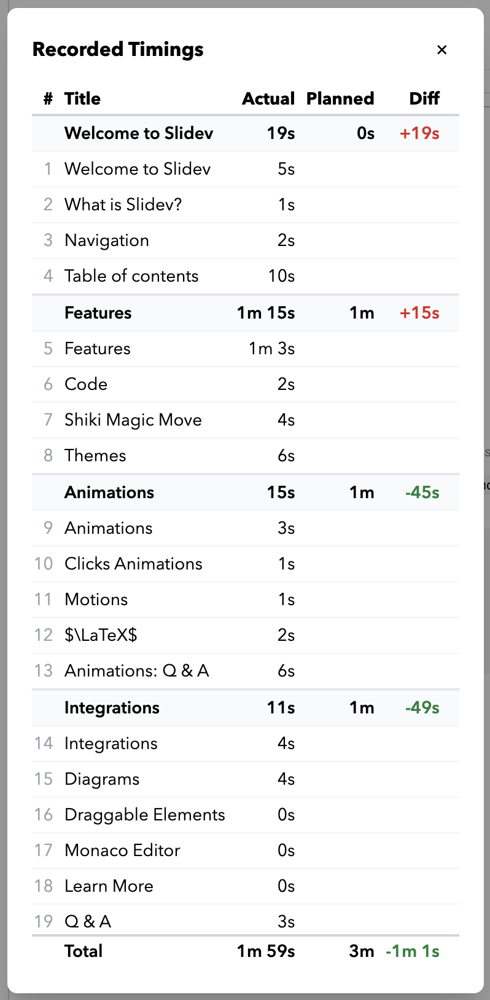

# slidev-addon-timing-bar

A [Slidev](https://sli.dev) addon that adds a section-based timing bar to the presenter view.
Plan your talk with per-section durations, track your progress in real time, and review recorded timings after your presentation.



## Installation

```bash
npm install slidev-addon-timing-bar
```

Add it to your Slidev headmatter:

```yaml
---
addons:
  - slidev-addon-timing-bar
---
```

## Usage

The timing bar appears automatically in **presenter mode**.
No additional setup is needed for a basic progress bar — just set a `duration` in your headmatter.

### Total duration only

The simplest configuration: set the overall presentation duration and the bar distributes time evenly across all slides.

```yaml
---
duration: 35min
---
```

### Section durations

Add `section` frontmatter to chapter title slides to define timed sections.
The timing bar sizes each section proportionally.

```yaml
---
section:
  duration: 10m
---
# My Section Title
```

Slides before the first `section:` slide form a prologue and are displayed as a fixed-width block outside the timed bar.

### Untimed sections

Use `section: true` to mark a section without a planned duration.
Untimed sections share any unallocated time proportionally by slide count.

```yaml
---
section: true
---
```

> [!NOTE]
> Mixing untimed sections (`section: true`) with buffer sections (`section: { buffer: true }`) is not supported.
> Buffer sections will be treated as untimed when both are present.

### Buffer points

Buffer sections absorb excess time when you run over in earlier sections.
They appear as hatched segments that grow as buffer is consumed.

The buffer comes from the difference between the duration of the overall presentation and the sum of all section durations, and before starting, it is shown as a hatched area at the end of the bar.
When you run over time in (or before reaching) a section with a buffer, the buffer is absorbed by this section, and the hatched area is moved to the end of this section.


```yaml
---
section:
  duration: 10m
  buffer: true
---
```

You can cap how much buffer a point can absorb:

```yaml
---
section:
  duration: 10m
  buffer: 2m
---
```

A pure buffer point (no content duration) renders as a zero-width wedge marker:

```yaml
---
section:
  buffer: true
---
```

### Duration formats

Durations support flexible formats: `5m`, `1h20m`, `90s`, `4m30s`, `1.5min`.

### End time

Set an `endTime` in headmatter to track when your talk should finish.
The timing bar can switch between duration mode and end-time mode in the presenter view.

```yaml
---
duration: 35min
endTime: '14:30'
---
```

## Features

### Timing bar

- Horizontal bar in the presenter view with one segment per section, sized proportionally to planned duration
- The progress arrow tracks the elapsed time, color-coded: **black** (on track), **green** (ahead of schedule), **red** (behind schedule)

  | Ahead of schedule                     | Behind schedule                   |
  | ------------------------------------- | --------------------------------- |
  |  |  |

- The current section is highlighted in blue, and the progress is shown by a progress bar within the segment.
- Hover over the progress bar to see the individual slide titles.
- Click a section or slide marker to navigate directly to it.

### Duration controls

Next to the Slidev clock, there are radio buttons labelled as ⏳ and 🕒 to toggle between duration mode and end-time mode.

- In duration mode, the available time is the time shown.
  If this duration is longer than the sum of all section durations, the excess time is treated as a buffer and shown as a hatched area at the end of the bar.
- In end-time mode, the available time is the time until the specified end time.
  Note that, if you pause and resume the timer, the available time will be recalculated.

If the available time is shorter than the sum of all section durations, the time allocated to each section is scaled down proportionally.
In this case, there will not be any buffer time allocated at all.

- Double-click the duration/end time in the radio button label to override these values.
  Delete the value to reset it.
- The **"Play to end"** button is only enabled when the end time is less than the duration.
  Click it to skip the timer ahead such that it will end on time.

### Timing review

- Click the catalog button to open a modal showing actual vs. planned time per section and per slide
- Also logs a text summary to the console.



### Toggle timing bar

- Click on the progress bar icon to move the timing bar to the top/bottom of the screen, or to hide it.
- The arrow in the button shows the bar’s current position.

## `section` frontmatter reference

| Value                                     | Effect                                                         |
| ----------------------------------------- | -------------------------------------------------------------- |
| `section: true`                           | Untimed section — shares unallocated time by slide count       |
| `section: { duration: 5m }`               | Timed section with a planned duration                          |
| `section: { buffer: true }`               | Pure buffer point (zero-width wedge, absorbs unlimited excess) |
| `section: { buffer: 1m }`                 | Buffer point with a cap on absorption                          |
| `section: { duration: 5m, buffer: true }` | Timed section that also acts as an unlimited buffer point      |
| `section: { duration: 5m, buffer: 1m }`   | Timed section that also acts as a capped buffer point          |

## AI Agent Skill

This addon ships with an [agent skill](https://skills.sh/) so AI coding assistants can help you configure timing sections:

```bash
npx skills add slidev-addon-timing-bar
```

## License

[MIT](./LICENSE)
